#Генерация расписания сессии

---

## Содержание
- [Алгоритм Генерации](#algorithm)
- [Данные](#data)
    * [Преподаватели](#lecturers)
    * [Дисциплины](#subjects)
    * [Академические группы](#groups)

<a href='https://docs.google.com/document/d/12Opyc3YQI_V0pUFLz4KGm0a24E0b56hB'>Отчёт по проекту</a>

## Алгоритм Генерации
При входе на сайт нас встречает инструкция по генерации расписания.
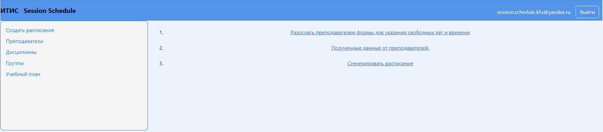
1. В первом пункте инструкции мы указываем тему, текст письма и ссылку на форму, выбираем преподавателей, которым на электронную почту будет рассылаться форма для заполнения пожеланий, где они могут указать дату и время удобную для проведения экзамена.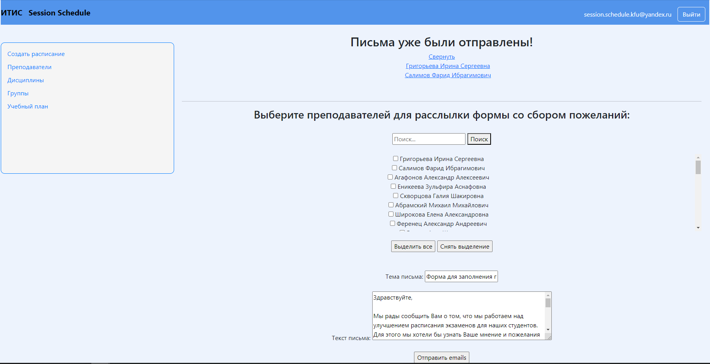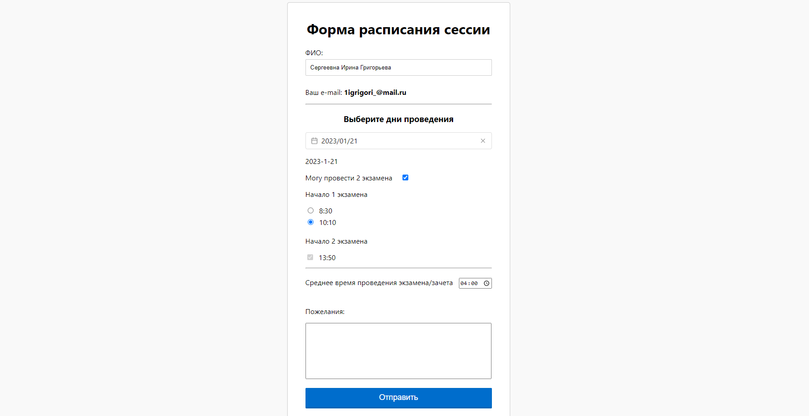
2. Далее после того как мы получили все данные от преподавателей, мы можем переходить к 3 пункту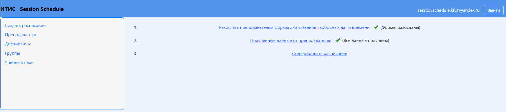
3. Тут указываем даты сессии, и если предыдущие пункты выполнены: кнопка становится кликабельной => генерируется расписание => появляется ссылка на Google таблицу.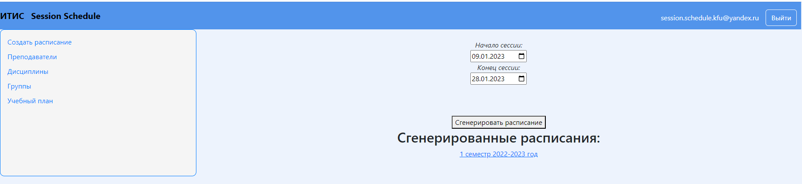 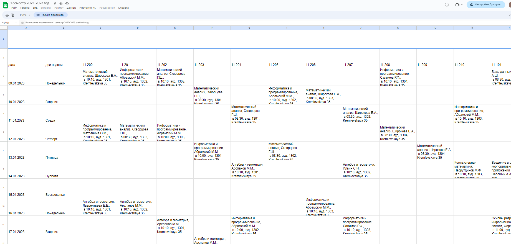

## Данные
В блоке слева мы можем увидеть данные, на основе которых и строится расписание.

### Преподаватели
В блоке преподавателей мы встречаем список всех преподавателей института
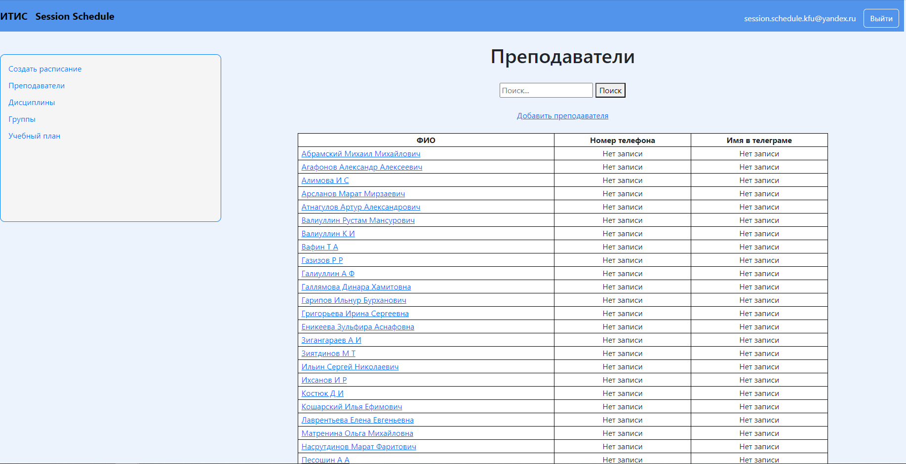
Мы можем добавить нового преподавателя
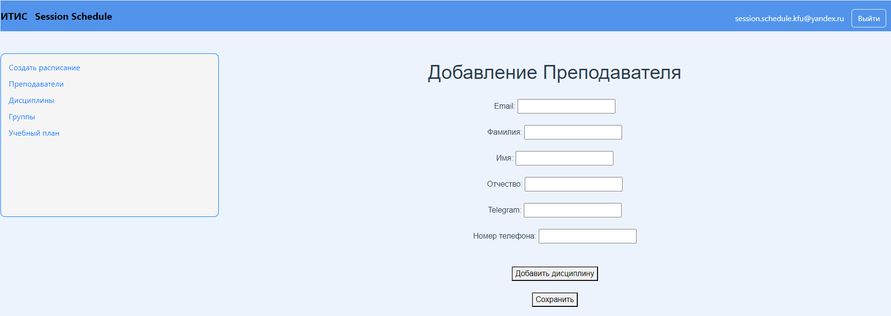
Посмотреть карточку преподавателя с информацией о его дисциплинах, которые также можно изменить
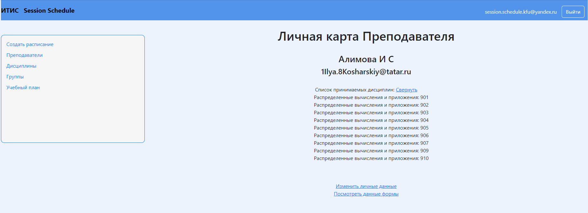
Также посмотреть информацию о заполнении формы, которую можно заполнить вместо преподавателя
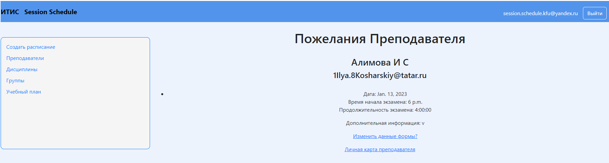

### Дисциплины
В блоке дисциплин мы можем увидеть общий список дисциплин, перейти в личную карточку дисциплины, где можем её отредактировать, удалить или добавить новую дисциплину
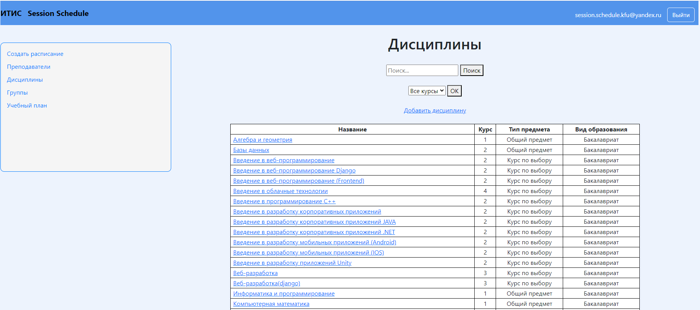

### Академические группы
Идентичный функционал в блоке академических групп
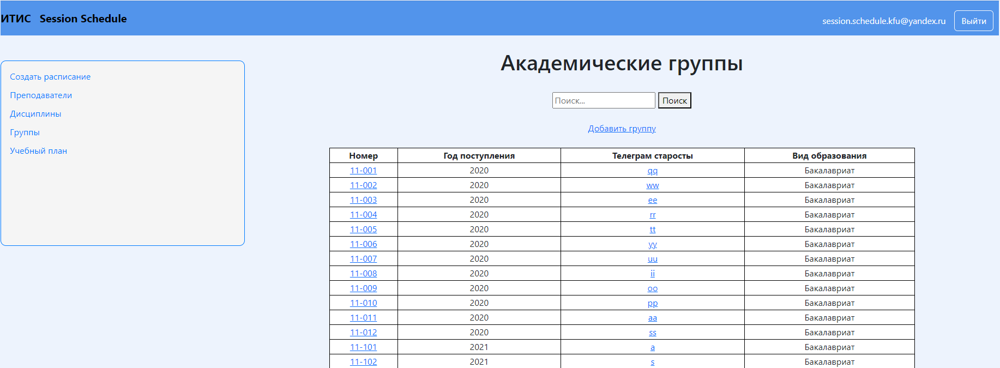
